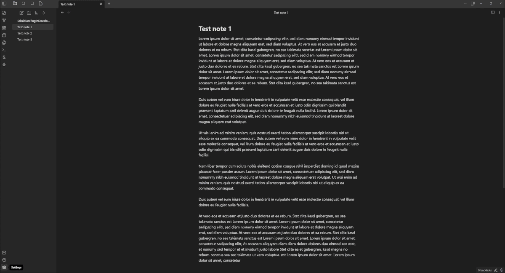

# Obsidian Custom Note Width

Control the line width of every note in Obsidian — individually, per note, or globally. A small control in the status bar gives you instant access, YAML frontmatter persists widths per note, and a new *Pills* mode lets you switch between presets with a single click.

## Features

- **Per-note widths** via YAML frontmatter
- **Status-bar controls** — choose between a classic slider or *Pills* (three preset buttons)
- **Three width units** — `%`, `px`, `ch`
- **Independent code block width** — so narrow prose and wide code can coexist
- **Hotkey-ready commands** for every width operation
- **Full English and German UI**

## Installation

### From Community Plugins

1. Open **Settings → Community plugins**
2. Browse → search *"Custom Note Width"*
3. Install → Enable

### Manual

1. Download `main.js`, `manifest.json` and `styles.css` from the [latest release](https://github.com/0skater0/obsidian-custom-note-width/releases)
2. Copy them into `<vault>/.obsidian/plugins/custom-note-width/`
3. Restart Obsidian and enable the plugin

> **Requirement:** Obsidian's *Readable line length* setting must be enabled (Settings → Editor → Readable line length).

## Usage

The plugin modifies Obsidian's `--file-line-width` CSS variable. Control it three ways:

| Method | Best for |
|--------|----------|
| **Status-bar control** (slider or pills) | Quick adjustments while reading/editing |
| **YAML frontmatter** (`custom-width: 60`) | Persisting a specific width per note |
| **Commands** (palette / hotkeys) | Power users, keyboard-driven workflows |

### Width units

- **%** — relative to the editor pane (0–100)
- **px** — absolute pixels (100–4000)
- **ch** — character widths (10–200)

Switch units via the unit label next to the slider/value (slider mode) or inside a preset editor (pills mode).

### Pills mode

Enable under **Settings → Control mode → Pills**. The status bar shows three buttons with your configured preset values. Click to apply. The button matching the currently applied width is highlighted; no button is active when the width is a custom value.

## Settings

<strong>Click to see every setting</strong>

 

| Setting | Description | Default |
|---------|-------------|---------|
| **Language** | Plugin UI language (Auto / English / Deutsch) | `Auto` |
| **Enable slider** | Shows the width control in the status bar | `on` |
| **Control mode** | *Slider* (draggable) or *Pills* (three preset buttons) | `Slider` |
| **Slider width** *(Slider mode)* | Horizontal size of the slider in pixels | `85` |
| **Pill preset 1–3** *(Pills mode)* | Value and unit per preset | `30%` / `50%` / `100%` |
| **Enable text field** | Numeric input next to the slider | `on` |
| **Default width unit** | Unit used for the global default width | `%` |
| **Default width** | Width applied when a note has no per-note width | `50` |
| **% range** | Min / max for percentage unit | `0 / 100` |
| **px range** | Min / max for pixel unit | `100 / 4000` |
| **ch range** | Min / max for character unit | `10 / 200` |
| **Enable per-note width** | Store widths in YAML frontmatter | `on` |
| **YAML front matter key** | Key used for per-note widths | `custom-width` |
| **Enable code block width** | Give code blocks an independent width | `off` |
| **Code block width unit** | Unit for code block width | `px` |
| **Code block width** | Size applied to code blocks | `800` |
| **Reading mode** | Apply code block width in preview | `on` |
| **Source mode** | Apply code block width in source view | `on` |
| **Live preview mode** | Apply code block width in live preview | `on` |

## Commands

All commands appear in the palette and can be bound to hotkeys under **Settings → Hotkeys** (filter: *Custom Note Width*):

| Command | Action |
|---------|--------|
| Change the width of the open note | Opens a modal, applies width to current note |
| Change the default note width | Opens a modal, updates the global default |
| Change the width for all notes | Opens a modal, rewrites every note's YAML width |
| Apply pill preset 1 / 2 / 3 | Applies the given preset (Pills mode only) |

## Theme compatibility

> **Disclaimer:** The plugin modifies `--file-line-width`. Custom themes may override this variable; there is no guarantee the plugin works with every theme.

| Theme | Status | Obsidian Version | Notes |
|-------|--------|------------------|-------|
| Default | Works | 1.12.4 | Fully functional |
| Things | Works | 1.12.4 | Fully functional |

Your theme isn't listed? Open a PR adding a row — see [CONTRIBUTING](CONTRIBUTING.md).

## Reporting bugs

Please include:

1. **Obsidian version** (`Settings → General`)
2. **Plugin version** (`Settings → Community plugins`)
3. **Theme name** (`Settings → Appearance → Themes`)
4. **Operating system**
5. **Console errors** — open DevTools (`Ctrl+Shift+I` / `Cmd+Option+I`), Console tab, copy anything red referencing `custom-note-width`
6. **Steps to reproduce** and what you expected vs what happened
7. **Screenshots or screen recordings** help a lot — tools like [LICEcap](https://www.cockos.com/licecap/) or [ShareX](https://getsharex.com/) work well

> Reports that only say *"it doesn't work"* can't be investigated — details make the difference.

## Backups

> **Always keep backups of your vault.** The plugin writes to YAML frontmatter; bugs are possible. Protect your data.

## Contributing

See [CONTRIBUTING.md](CONTRIBUTING.md) for development setup, code style, and the PR process.

## License

[MIT](LICENSE) — provided as-is, no warranty.

## Support

